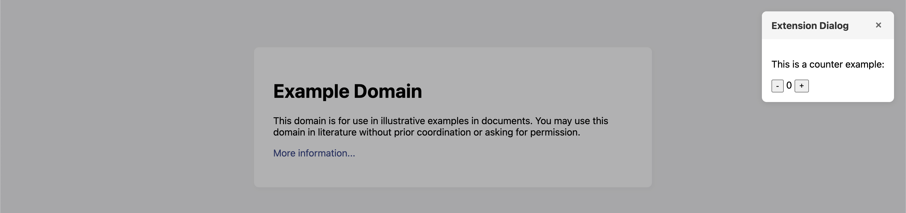

# Popup with curved corners

You can't actually curve the corners of the [popup window](https://developer.chrome.com/docs/extensions/develop/ui/add-popup) as it is an OS level window only the browser has access to.

The next best thing is to use the content script to create a dialog with curved corners. This is what this repo does.

This is an example for anyone who may need to find a way to curve the corners of a browser extension popup

